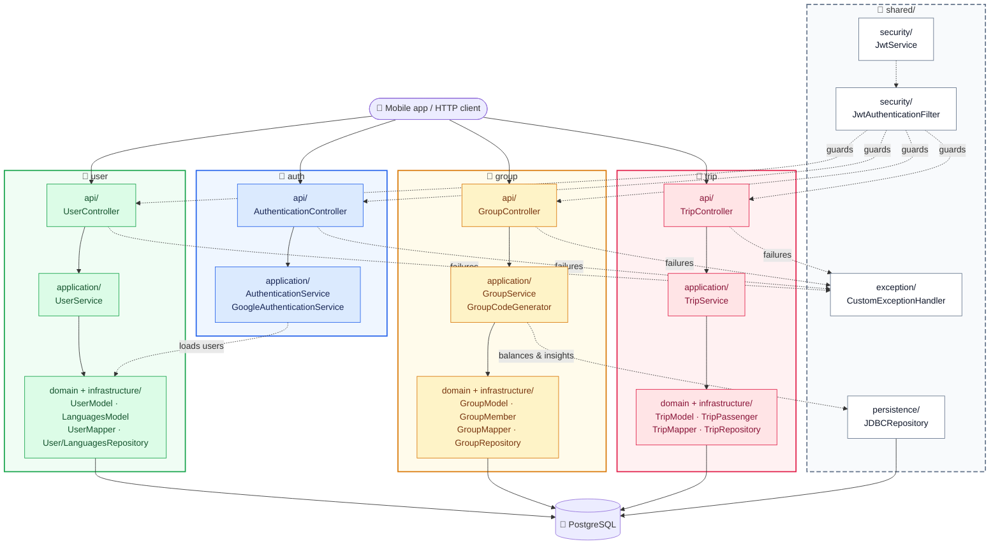

# Architecture

## Overview

Layered Spring Boot monolith: mobile/HTTP clients call JWT-secured REST controllers, which delegate to domain services, which persist via Spring Data JPA to PostgreSQL. Google Sign-In is verified server-side; tokens are HS256 JWTs with 1-hour lifetime.

Inferred from code:



How to read it: each solid column is a feature with its own top-to-bottom pipeline (`api/` → `application/` → `domain/` + `infrastructure/`). The dashed `shared/` column is cross-cutting: it guards the APIs, handles their failures, and serves aggregate queries. The only cross-column edges are the two dotted ones (`auth` loads users, `group` aggregates via JDBC).

Request path: `Controller (*/api/)` → `Service (*/application/)` → `Repository (*/infrastructure/persistence/ + shared/persistence/)` → `PostgreSQL`.

## Architectural Style

Layered modular monolith.

- Controllers are HTTP-only.
- Services own business rules (membership checks, balance math, insights aggregation).
- Repositories own persistence.

It fits because the domain is small (users, groups, trips) with clear CRUD-plus-rules boundaries and a single deployable WAR — no need for distributed services.

## Project Structure

```text
src/main/java/neflo/dev/
  MainApplication.java / ServletInitializer.java
  shared/
    exception/       # CustomErrorResponse, CustomExceptionHandler + typed runtime exceptions
    security/        # SecurityConfig, JwtAuthenticationFilter, JwtService
    config/          # DriveMeMaybeAPIConfig
    persistence/     # JDBCRepository (aggregate queries)
    dto/             # YearMonth (cross-feature value object)
  auth/
    api/             # AuthenticationController, GoogleLoginDTO, LoginResponse
    application/     # AuthenticationService, GoogleAuthenticationService
  user/
    api/             # UserController + UserDTO, UserResponseDTO, UserLoginDTO, UserPreferences(+Filters), UserRequestDTO
    application/     # UserService
    domain/          # UserModel, LanguagesModel
    infrastructure/persistence/  # UserRepository, LanguagesRepository
    infrastructure/mapper/       # UserMapper (MapStruct)
  group/
    api/             # GroupController + GroupDTO, GroupRequestDTO, GroupMemberDTO, GroupMemberBalanceDTO, GroupInsights(+Request, +PeriodTypes)
    application/     # GroupService, GroupCodeGenerator
    domain/          # GroupModel, GroupMember
    infrastructure/persistence/  # GroupRepository
    infrastructure/mapper/       # GroupMapper
  trip/
    api/             # TripController + TripDTO, TripCreateDTO, TripRequestDTO
    application/     # TripService
    domain/          # TripModel, TripPassenger
    infrastructure/persistence/  # TripRepository
    infrastructure/mapper/       # TripMapper
src/main/resources/
  application.properties / .env.example
```

## Modules

### Auth

- Does: signup, email/password login, Google login, token refresh, JWT issuance/validation.
- Key files: `auth/api/AuthenticationController.java`, `auth/application/` (`AuthenticationService`, `GoogleAuthenticationService`), `shared/security/JwtService`, `shared/security/SecurityConfig.java`, `shared/security/JwtAuthenticationFilter.java`.
- Endpoints: `POST /auth/signup`, `POST /auth/login`, `GET /auth/refresh`, `POST /auth/google/login`.

### Users

- Does: profile, preferences, own groups, join-by-code, update/delete.
- Key files: `user/api/UserController.java`, `user/application/UserService.java`, `user/infrastructure/mapper/UserMapper.java`, `user/infrastructure/persistence/UserRepository.java`, `user/infrastructure/persistence/LanguagesRepository.java`.
- Endpoints: `GET /users/profile`, `GET /users/prefs`, `GET /users/groups`, `GET /users/groups/join/{groupCode}`, `PUT /users/update`, `DELETE /users/delete`.
- Preferences: `preferredLang` resolved case-insensitively (default `EN`); `GET /users/prefs` returns `{code, formalName}` entries sorted by code.

### Groups

- Does: group lifecycle, membership checks, balances, trip listing, insights.
- Key files: `group/api/GroupController.java`, `group/application/GroupService.java`, `group/application/GroupCodeGenerator.java`, `group/infrastructure/mapper/GroupMapper.java`, `group/infrastructure/persistence/GroupRepository.java`, `group/domain/GroupMember.java`.
- Endpoints: `POST /groups/group`, `GET /groups/{groupId}`, `GET /groups/{groupId}/members`, `GET /groups/{groupId}/members/balance`, `GET /groups/{groupId}/trips`, `POST /groups/{groupId}/insights`, `PUT /groups/{groupId}/update`, `PUT /groups/{groupId}/leave`.
- `GroupDTO` carries derived counts: `groupMembers`, `groupTrips`.

### Trips

- Does: trip recording, detail, update, delete. Driver and passengers must be group members.
- Key files: `trip/api/TripController.java`, `trip/application/TripService.java`, `trip/infrastructure/mapper/TripMapper.java`, `trip/infrastructure/persistence/TripRepository.java`, `trip/domain/TripPassenger.java`.
- Endpoints: `POST /trips/{groupId}/trip`, `GET /trips/{groupId}/{tripId}`, `PUT /trips/{groupId}/{tripId}`, `DELETE /trips/{groupId}/{tripId}`.

## Dependency Rules

Allowed direction (one way only) per feature: `api/` → `application/` → `domain/` + `infrastructure/persistence/` → DB. `shared/` is cross-cutting and holds no domain logic.

- Mappers (`*/infrastructure/mapper/`) convert entities ↔ DTOs and are used by `application/` services — never directly by repositories.
- `shared/security/`, `shared/config/`, `shared/exception/` hold no domain logic.
- No reverse imports: `application/` never imports `api/` controllers; `infrastructure/persistence/` never imports `application/` services.
- Cross-feature: `group/` and `trip/` may depend on `user/domain/` (membership checks); `auth/` depends on `user/`; `shared/persistence/JDBCRepository` serves group insights/balances. `shared/dto/YearMonth` is dependency-free (use `YearMonth.of(year, month)`).
- Trip logic checks membership via group/member state but does not bypass `GroupService` ownership of membership rules where shared.

## Data Flow

End-to-end example — record a trip:

1. Client sends `POST /trips/{groupId}/trip` with `Authorization: Bearer <token>` and `TripCreateDTO`.
2. `JwtAuthenticationFilter` extracts the subject, loads the user, validates the JWT, and sets the `SecurityContext`.
3. `TripController` passes `userId`, `groupId`, DTO to `TripService`.
4. Service verifies caller and driver/passengers are group members, then maps DTO → entities via `TripMapper` and persists trip + `TripPassenger` rows in a transaction.
5. Controller returns `TripDTO` with the resolved driver nickname. Failures map to `CustomErrorResponse` via `CustomExceptionHandler`.

Balance read (`GET /groups/{groupId}/members/balance`) aggregates trips per member: driving adds time/km, riding subtracts, returned as `GroupMemberBalanceDTO` list.

## External Dependencies

- PostgreSQL 14+ (relational store, via Spring Data JPA/JDBC + PostgreSQL driver).
- Google Identity Services (ID-token verification via `google-api-client` 2.8.1, audience = `OAUTH2_GOOGLE_CLIENT_ID`).
- No queues or other third-party APIs.

## Persistence

- Entities live in `*/domain/` (`user/domain/UserModel`, `user/domain/LanguagesModel`, `group/domain/GroupModel`, `group/domain/GroupMember`, `trip/domain/TripModel`, `trip/domain/TripPassenger`).
- `UserModel` holds `PREF_DARK_MODE` plus a `@OneToOne` `PREF_LANG` join to `LanguagesModel` (`USR_PREFS_LANGUAGES`: `ID`, `CODE(2)`, `FORMAL_NAME`).
- Access via Spring Data JPA (`UserRepository`, `GroupRepository`, `TripRepository`, `LanguagesRepository` with case-insensitive `findByCode`) plus `JDBCRepository` for aggregate queries (balances, insights).
- DDL is JPA-managed (no migration folder in repo).
- Transaction boundaries live in services; multi-row writes (trip + passengers, group + membership) must be atomic.

## Security

- Routes (`SecurityConfig`): `POST /auth/**` public; `GET /auth/refresh` authenticated; everything else authenticated.
- Stateless sessions; CSRF disabled.
- CORS allows `GET, POST, PUT, DELETE` with `Authorization, Content-Type` headers.
- Tokens: HS256 JWT, Base64-decoded `JWT_SECRET_KEY`, 1-hour expiry, subject = username/email.
- No roles — authorization is membership checks (members-only group/trip access).
- Secrets come from the environment only.

## Error Handling

Same envelope as README Usage > Error handling (`CustomErrorResponse`: `errorCode`, `detail`, `statusCode`, `statusName`, `timestamp`).

- `ValidationException` → 400.
- `AuthenticationException` → 401.
- JWT/filter failures → 403 (`authorizationException`).
- `NoEntitiesFoundException` → 404.
- `DatabaseException` / `UnexpectedException` / generic `Exception` → 500.

Known quirk: the handler always builds the body with `HttpStatus.NOT_FOUND` while the HTTP status line carries the real code.

## Design Principles

- Thin controllers, rich services.
- API never exposes entities — DTO records only.
- Validation at the API boundary (`UserDTO`, `TripCreateDTO`, `GroupRequestDTO`, `GroupInsightsRequest`).
- MapStruct mappers for entity ↔ DTO conversion.
- Centralized errors; no leaked stack traces.
- Auth separated from domain logic.

## Known Trade-offs

- Creates/updates return HTTP 200 instead of 201 — simpler client handling, less REST-strict.
- Error body `statusCode`/`statusName` currently hardcode `NOT_FOUND` — clients should rely on the HTTP status line until fixed.
- No pagination on member/trip lists — fine at current group sizes, will need limits later.
- No refresh-token rotation — re-issue via `GET /auth/refresh` keeps auth simple at the cost of requiring a still-valid JWT.
