# DiveMeMaybeAPI

> Backend API for **DriveMeMaybe**, a mobile application for tracking shared trips and keeping driving balances fair.

DiveMeMaybeAPI is the REST API that powers DriveMeMaybe. It manages users, trip groups, group members, trips, and the balance of each member based on their participation in those trips.

The project is built with **Spring Boot** and is designed to be consumed by the DriveMeMaybe mobile application.

## How does it work?

A user can create a **trip group** and invite other users to join it.

Within a group, members can record trips by selecting:

* The driver
* One or more passengers
* The trip duration or distance
* Additional information about the trip

Each trip affects the balance of the people involved.

For example, if Alice drives Bob for 50 km:

```text
Alice   +50 km
Bob     -50 km
```

The same concept can be applied using time instead of distance, depending on the group's configuration.

This allows groups to keep track of who has been driving and riding over time without having to manually calculate the difference.

## Main concepts

### Users

Users represent the people using the application.

A user can belong to multiple trip groups and participate in multiple trips.

### Trip Groups

A trip group is a collection of users who want to track their shared trips.

Each group defines how balances are measured:

```text
DISTANCE
TIME
```

### Trips

A trip records a single journey made by members of a group.

A trip contains:

* A driver
* One or more passengers
* A distance or duration
* Optional additional information
* The user who created the trip record

The person creating the record does not necessarily have to be the driver.

### Balances

A member's balance represents their accumulated participation in the group's trips.

Being the driver increases the balance, while being a passenger decreases it.

This makes it possible to see who has contributed more driving time or distance within the group.

## Architecture

```mermaid
flowchart TD
subgraph group_runtime["Runtime"]
  node_application{{"Spring Boot application<br/>runtime entry"}}
  node_servlet["Servlet initializer<br/>deployment adapter"]
end

subgraph group_api["HTTP API"]
  node_auth_controller["Authentication API<br/>REST controller"]
  node_group_controller["Groups API<br/>REST controller"]
  node_trip_controller["Trips API<br/>REST controller"]
  node_api_dtos["API DTO contracts<br/>request/response DTOs<br/>[GroupInsights.java]"]
  node_exception_handler["API exception handler<br/>error boundary"]
end

subgraph group_security["Security"]
  node_security_config["Route security policy<br/>security configuration"]
  node_jwt_filter["JWT request filter<br/>security filter"]
  node_authentication_service["Authentication service<br/>application service"]
  node_jwt_service["JWT service<br/>token service<br/>[JwtService.java]"]
  node_google_auth["Google authentication<br/>external auth adapter"]
end

subgraph group_domain["Domain services"]
  node_group_service["Group service<br/>application service<br/>[GroupService.java]"]
  node_trip_service["Trip service<br/>application service<br/>[TripService.java]"]
  node_group_membership["Groups and memberships<br/>domain model<br/>[GroupMember.java]"]
  node_trip_participation["Trips and passengers<br/>domain model<br/>[TripPassenger.java]"]
  node_trip_mapper["Trip mapper<br/>DTO mapper<br/>[TripMapper.java]"]
end

subgraph group_persistence["Persistence"]
  node_jpa_repositories["JPA repositories<br/>repository interfaces"]
  node_postgres[("PostgreSQL<br/>relational database")]
end

node_servlet -->|"initializes"| node_application
node_application -->|"loads"| node_security_config
node_security_config -->|"installs"| node_jwt_filter
node_jwt_filter -->|"validates token"| node_jwt_service
node_auth_controller -->|"login requests"| node_authentication_service
node_authentication_service -->|"issues tokens"| node_jwt_service
node_authentication_service -->|"Google login"| node_google_auth
node_group_controller -->|"group operations"| node_group_service
node_trip_controller -->|"trip operations"| node_trip_service
node_auth_controller -->|"uses"| node_api_dtos
node_group_controller -->|"uses insights DTOs"| node_api_dtos
node_trip_controller -->|"uses trip DTOs"| node_api_dtos
node_group_service -->|"manages"| node_group_membership
node_trip_service -->|"checks membership"| node_group_membership
node_trip_service -->|"records"| node_trip_participation
node_trip_service -->|"maps responses"| node_trip_mapper
node_group_service -->|"persists and queries"| node_jpa_repositories
node_trip_service -->|"persists and queries"| node_jpa_repositories
node_authentication_service -->|"loads users"| node_jpa_repositories
node_jpa_repositories -->|"JPA access"| node_postgres
node_auth_controller -.->|"errors"| node_exception_handler
node_group_controller -.->|"errors"| node_exception_handler
node_trip_controller -.->|"errors"| node_exception_handler

click node_application "https://github.com/neflodev/drivememaybeapi/blob/main/src/main/java/neflo/dev/MainApplication.java"
click node_servlet "https://github.com/neflodev/drivememaybeapi/blob/main/src/main/java/neflo/dev/ServletInitializer.java"
click node_auth_controller "https://github.com/neflodev/drivememaybeapi/blob/main/src/main/java/neflo/dev/web/AuthenticationController.java"
click node_group_controller "https://github.com/neflodev/drivememaybeapi/blob/main/src/main/java/neflo/dev/web/GroupController.java"
click node_trip_controller "https://github.com/neflodev/drivememaybeapi/blob/main/src/main/java/neflo/dev/web/TripController.java"
click node_api_dtos "https://github.com/neflodev/drivememaybeapi/blob/main/src/main/java/neflo/dev/model/dto/group/GroupInsights.java"
click node_security_config "https://github.com/neflodev/drivememaybeapi/blob/main/src/main/java/neflo/dev/config/SecurityConfig.java"
click node_jwt_filter "https://github.com/neflodev/drivememaybeapi/blob/main/src/main/java/neflo/dev/config/JwtAuthenticationFilter.java"
click node_authentication_service "https://github.com/neflodev/drivememaybeapi/blob/main/src/main/java/neflo/dev/service/authentication/AuthenticationService.java"
click node_jwt_service "https://github.com/neflodev/drivememaybeapi/blob/main/src/main/java/neflo/dev/service/authentication/JwtService.java"
click node_google_auth "https://github.com/neflodev/drivememaybeapi/blob/main/src/main/java/neflo/dev/service/authentication/GoogleAuthenticationService.java"
click node_group_service "https://github.com/neflodev/drivememaybeapi/blob/main/src/main/java/neflo/dev/service/GroupService.java"
click node_trip_service "https://github.com/neflodev/drivememaybeapi/blob/main/src/main/java/neflo/dev/service/TripService.java"
click node_group_membership "https://github.com/neflodev/drivememaybeapi/blob/main/src/main/java/neflo/dev/model/relation/GroupMember.java"
click node_trip_participation "https://github.com/neflodev/drivememaybeapi/blob/main/src/main/java/neflo/dev/model/relation/TripPassenger.java"
click node_trip_mapper "https://github.com/neflodev/drivememaybeapi/blob/main/src/main/java/neflo/dev/mapper/TripMapper.java"
click node_jpa_repositories "https://github.com/neflodev/drivememaybeapi/blob/main/src/main/java/neflo/dev/repository/TripRepository.java"
click node_exception_handler "https://github.com/neflodev/drivememaybeapi/blob/main/src/main/java/neflo/dev/config/CustomExceptionHandler.java"

classDef toneNeutral fill:#f8fafc,stroke:#334155,stroke-width:1.5px,color:#0f172a
classDef toneBlue fill:#dbeafe,stroke:#2563eb,stroke-width:1.5px,color:#172554
classDef toneAmber fill:#fef3c7,stroke:#d97706,stroke-width:1.5px,color:#78350f
classDef toneMint fill:#dcfce7,stroke:#16a34a,stroke-width:1.5px,color:#14532d
classDef toneRose fill:#ffe4e6,stroke:#e11d48,stroke-width:1.5px,color:#881337
classDef toneIndigo fill:#e0e7ff,stroke:#4f46e5,stroke-width:1.5px,color:#312e81
classDef toneTeal fill:#ccfbf1,stroke:#0f766e,stroke-width:1.5px,color:#134e4a
class node_application,node_servlet toneBlue
class node_auth_controller,node_group_controller,node_trip_controller,node_api_dtos,node_exception_handler toneAmber
class node_security_config,node_jwt_filter,node_authentication_service,node_jwt_service,node_google_auth toneMint
class node_group_service,node_trip_service,node_group_membership,node_trip_participation,node_trip_mapper toneRose
class node_jpa_repositories,node_postgres toneIndigo
```



The application follows a layered architecture:

```text
Controller
    │
    ▼
Service
    │
    ▼
Repository
    │
    ▼
Database
```

The main responsibilities are separated into:

* **Runtime** — Spring Boot entry point and servlet initializer.
* **HTTP API** — REST controllers, DTO contracts, and exception handling.
* **Security** — Route policy, JWT filter, authentication service, and Google login.
* **Domain services** — Group and trip services, membership checks, and DTO mapping.
* **Persistence** — JPA repositories backed by PostgreSQL.

This separation keeps the HTTP layer, business logic, and persistence logic independent from each other.

## Technology Stack

| Technology      | Purpose                          |
| --------------- | -------------------------------- |
| Java 21         | Programming language             |
| Spring Boot     | Application framework            |
| Spring Web      | REST API                         |
| Spring Data JPA | Database persistence             |
| PostgreSQL      | Relational database              |
| Spring Security | Authentication and authorization |
| JWT             | Stateless authentication         |
| MapStruct       | DTO/entity mapping               |
| Lombok          | Boilerplate reduction            |
| Maven           | Dependency management and build  |

## Requirements

Before running the project locally, make sure you have:

* Java 21 or newer
* Maven
* PostgreSQL
* A configured database for the application

You can verify your Java installation with:

```bash
java --version
```

and Maven with:

```bash
mvn --version
```

## Getting Started

### 1. Clone the repository

```bash
git clone https://github.com/NefloDev/DiveMeMaybeAPI.git
cd DiveMeMaybeAPI
```

### 2. Configure the database

Create a PostgreSQL database for the application and configure the database connection in the application's configuration.

Do not commit passwords, JWT secrets, API keys, or other sensitive configuration to the repository.

For local development, environment variables or a local configuration file should be used instead.

### 3. Add your environment variables

Copy `.env.example` to `.env` and fill in the required values:

```bash
cp .env.example .env
```

### 4. Build the project

```bash
mvn clean install
```

### 5. Run the application

You can start the application using:

```bash
mvn spring-boot:run
```

Alternatively, build the application and run the generated artifact.

## API

The API exposes REST endpoints for the main resources used by DriveMeMaybe.

The main areas of the API are:

```text
Authentication
    └── User registration and authentication

Users
    └── User information and management

Groups
    ├── Create and manage groups
    └── Manage group members

Trips
    ├── Create trips
    ├── Retrieve trips
    └── Manage trip information

Balances
    └── Calculate member balances within a group
```

For a complete list of available endpoints, request/response models, and authentication requirements, see the controller classes in:

```text
src/main/java/
```

## Project Structure

The project is organized around the application's main responsibilities.

A simplified view looks like this:

```text
src/
└── main/
    ├── java/
    │   └── neflo/dev/
    │       ├── controller/
    │       ├── service/
    │       ├── repository/
    │       ├── model/
    │       │   ├── entity/
    │       │   └── dto/
    │       ├── mapper/
    │       ├── security/
    │       └── exceptions/
    │
    └── resources/
        └── application.properties
```

The exact package structure may evolve as the project grows, but the goal is to keep each part of the application focused on a single responsibility.

## Authentication

Protected endpoints require authentication using a JWT.

After authenticating, the client should include the token in the `Authorization` header:

```http
Authorization: Bearer <token>
```

The API validates the token before allowing access to protected resources.

## Development

This project is primarily developed as the backend for the DriveMeMaybe mobile application, but the API can also be used independently by other clients.

When adding new functionality, try to keep the following principles in mind:

* Keep controllers focused on HTTP concerns.
* Keep business logic inside services.
* Avoid exposing database entities directly through the API.
* Use DTOs for API requests and responses.
* Validate incoming data at the API boundary.
* Keep authentication and authorization separate from business logic.
* Add tests when introducing or changing business rules.

## Testing

Run the test suite with:

```bash
mvn test
```

Before submitting a change, make sure the project builds successfully and existing tests continue to pass.

## Contributing

Contributions are welcome.

If you find a bug, have an idea, or want to improve the project, feel free to:

1. Open an issue describing the problem or proposal.
2. Fork the repository.
3. Create a branch for your changes.
4. Make your changes.
5. Add or update tests where appropriate.
6. Open a pull request.

For larger changes, opening an issue first is recommended so the approach can be discussed before implementation.

## Related Project

This API is the backend for the [DriveMeMaybe](https://github.com/NefloDev/DiveMeMaybe) mobile application.

> **DriveMeMaybe** — A simple way to track who drives, who rides, and keep things fair.

## License

This project is open source. See the [LICENSE](LICENSE) file for details.
