# DriveMeMaybeAPI

> Backend API for **DriveMeMaybe**, a mobile app for tracking shared trips and keeping driving balances fair.

[](https://openjdk.org/projects/jdk/21/)
[](https://spring.io/projects/spring-boot)
[](https://www.postgresql.org/)
[](LICENSE)

DriveMeMaybeAPI is the REST API that powers DriveMeMaybe. It manages users, trip groups, group members, trips, and each member's balance based on participation.

Built with **Spring Boot** and designed to be consumed by the DriveMeMaybe mobile app — but usable by any HTTP client.

## Contents

- [Features](#features)
- [How does it work?](#how-does-it-work)
- [Main concepts](#main-concepts)
- [Architecture](#architecture)
- [Technology stack](#technology-stack)
- [Requirements](#requirements)
- [Quickstart](#quickstart)
- [Configuration](#configuration)
- [Running the application](#running-the-application)
- [API reference](#api-reference)
- [Authentication](#authentication)
- [Error handling](#error-handling)
- [Project structure](#project-structure)
- [Development](#development)
- [Testing](#testing)
- [Contributing](#contributing)
- [Related project](#related-project)
- [License](#license)

## Features

- Email/password signup and login with JWT
- Google Sign-In via ID-token verification
- Token refresh for active sessions
- Trip groups with invite-by-code
- Group member management and leave flow
- Trip recording with driver + passengers, distance or duration
- Per-member balances and group insights (by year / month)
- Centralized error responses
- Stateless Spring Security with JWT filter and CORS

## How does it work?

1. A user creates a **trip group** and shares the group code.
2. Other users join with `GET /users/groups/join/{groupCode}`.
3. Members record trips with a driver, one or more passengers, and either distance or duration.
4. Each trip moves balances: driving increases balance, riding decreases it.

Example — Alice drives Bob for 50 km:

```text
Alice   +50 km
Bob     -50 km
```

The same idea works with time when the group tracks minutes instead of kilometers. Over time the group can see who has driven more without manual math.

Typical client flow:

```text
POST /auth/signup → get JWT
POST /groups/group → create group → share groupCode
GET  /users/groups/join/{groupCode} → second user joins
POST /trips/{groupId}/trip → record a trip
GET  /groups/{groupId}/members/balance → see who is ahead / behind
```

## Main concepts

### Users

People using the app. A user can belong to many groups and take part in many trips.

Key fields (`UserDTO`): `email`, `password`, `name`, `nickname`, optional profile picture (`pfp`).

### Trip groups

A collection of users tracking trips together. Groups are joined via a generated `groupCode`.

Create payload (`GroupRequestDTO`):

```json
{
  "name": "Weekend road crew",
  "pfp": "https://example.com/pfp.png"
}
```

### Trips

One journey inside a group. Contains a driver, passengers, date, distance and/or duration, origin/destination, notes, and the creator (who need not be the driver).

Create payload (`TripCreateDTO`):

```json
{
  "driver": "11111111-1111-1111-1111-111111111111",
  "date": "2026-09-17",
  "durationMinutes": 45,
  "distanceKm": 50,
  "origin": "Berlin",
  "destination": "Potsdam",
  "notes": "Evening return",
  "passengers": ["22222222-2222-2222-2222-222222222222"]
}
```

### Balances and insights

Balance = accumulated driving contribution. Drivers go up, passengers go down.

Insights (`GroupInsights`) aggregate driving time per driver for a given year and optional month:

```json
{
  "year": 2026,
  "month": 9
}
```

## Architecture

```mermaid
flowchart TD
subgraph group_runtime["Runtime"]
  node_application{{"Spring Boot application<br/>runtime entry"}}
  node_servlet["Servlet initializer<br/>deployment adapter"]
end

subgraph group_api["HTTP API"]
  node_auth_controller["Authentication API<br/>REST controller"]
  node_group_controller["Groups API<br/>REST controller"]
  node_trip_controller["Trips API<br/>REST controller"]
  node_api_dtos["API DTO contracts<br/>request/response DTOs<br/>[GroupInsights.java]"]
  node_exception_handler["API exception handler<br/>error boundary"]
end

subgraph group_security["Security"]
  node_security_config["Route security policy<br/>security configuration"]
  node_jwt_filter["JWT request filter<br/>security filter"]
  node_authentication_service["Authentication service<br/>application service"]
  node_jwt_service["JWT service<br/>token service<br/>[JwtService.java]"]
  node_google_auth["Google authentication<br/>external auth adapter"]
end

subgraph group_domain["Domain services"]
  node_group_service["Group service<br/>application service<br/>[GroupService.java]"]
  node_trip_service["Trip service<br/>application service<br/>[TripService.java]"]
  node_group_membership["Groups and memberships<br/>domain model<br/>[GroupMember.java]"]
  node_trip_participation["Trips and passengers<br/>domain model<br/>[TripPassenger.java]"]
  node_trip_mapper["Trip mapper<br/>DTO mapper<br/>[TripMapper.java]"]
end

subgraph group_persistence["Persistence"]
  node_jpa_repositories["JPA repositories<br/>repository interfaces"]
  node_postgres[("PostgreSQL<br/>relational database")]
end

node_servlet -->|"initializes"| node_application
node_application -->|"loads"| node_security_config
node_security_config -->|"installs"| node_jwt_filter
node_jwt_filter -->|"validates token"| node_jwt_service
node_auth_controller -->|"login requests"| node_authentication_service
node_authentication_service -->|"issues tokens"| node_jwt_service
node_authentication_service -->|"Google login"| node_google_auth
node_group_controller -->|"group operations"| node_group_service
node_trip_controller -->|"trip operations"| node_trip_service
node_auth_controller -->|"uses"| node_api_dtos
node_group_controller -->|"uses insights DTOs"| node_api_dtos
node_trip_controller -->|"uses trip DTOs"| node_api_dtos
node_group_service -->|"manages"| node_group_membership
node_trip_service -->|"checks membership"| node_group_membership
node_trip_service -->|"records"| node_trip_participation
node_trip_service -->|"maps responses"| node_trip_mapper
node_group_service -->|"persists and queries"| node_jpa_repositories
node_trip_service -->|"persists and queries"| node_jpa_repositories
node_authentication_service -->|"loads users"| node_jpa_repositories
node_jpa_repositories -->|"JPA access"| node_postgres
node_auth_controller -.->|"errors"| node_exception_handler
node_group_controller -.->|"errors"| node_exception_handler
node_trip_controller -.->|"errors"| node_exception_handler

click node_application "https://github.com/neflodev/drivememaybeapi/blob/main/src/main/java/neflo/dev/MainApplication.java"
click node_servlet "https://github.com/neflodev/drivememaybeapi/blob/main/src/main/java/neflo/dev/ServletInitializer.java"
click node_auth_controller "https://github.com/neflodev/drivememaybeapi/blob/main/src/main/java/neflo/dev/web/AuthenticationController.java"
click node_group_controller "https://github.com/neflodev/drivememaybeapi/blob/main/src/main/java/neflo/dev/web/GroupController.java"
click node_trip_controller "https://github.com/neflodev/drivememaybeapi/blob/main/src/main/java/neflo/dev/web/TripController.java"
click node_api_dtos "https://github.com/neflodev/drivememaybeapi/blob/main/src/main/java/neflo/dev/model/dto/group/GroupInsights.java"
click node_security_config "https://github.com/neflodev/drivememaybeapi/blob/main/src/main/java/neflo/dev/config/SecurityConfig.java"
click node_jwt_filter "https://github.com/neflodev/drivememaybeapi/blob/main/src/main/java/neflo/dev/config/JwtAuthenticationFilter.java"
click node_authentication_service "https://github.com/neflodev/drivememaybeapi/blob/main/src/main/java/neflo/dev/service/authentication/AuthenticationService.java"
click node_jwt_service "https://github.com/neflodev/drivememaybeapi/blob/main/src/main/java/neflo/dev/service/authentication/JwtService.java"
click node_google_auth "https://github.com/neflodev/drivememaybeapi/blob/main/src/main/java/neflo/dev/service/authentication/GoogleAuthenticationService.java"
click node_group_service "https://github.com/neflodev/drivememaybeapi/blob/main/src/main/java/neflo/dev/service/GroupService.java"
click node_trip_service "https://github.com/neflodev/drivememaybeapi/blob/main/src/main/java/neflo/dev/service/TripService.java"
click node_group_membership "https://github.com/neflodev/drivememaybeapi/blob/main/src/main/java/neflo/dev/model/relation/GroupMember.java"
click node_trip_participation "https://github.com/neflodev/drivememaybeapi/blob/main/src/main/java/neflo/dev/model/relation/TripPassenger.java"
click node_trip_mapper "https://github.com/neflodev/drivememaybeapi/blob/main/src/main/java/neflo/dev/mapper/TripMapper.java"
click node_jpa_repositories "https://github.com/neflodev/drivememaybeapi/blob/main/src/main/java/neflo/dev/repository/TripRepository.java"
click node_exception_handler "https://github.com/neflodev/drivememaybeapi/blob/main/src/main/java/neflo/dev/config/CustomExceptionHandler.java"

classDef toneNeutral fill:#f8fafc,stroke:#334155,stroke-width:1.5px,color:#0f172a
classDef toneBlue fill:#dbeafe,stroke:#2563eb,stroke-width:1.5px,color:#172554
classDef toneAmber fill:#fef3c7,stroke:#d97706,stroke-width:1.5px,color:#78350f
classDef toneMint fill:#dcfce7,stroke:#16a34a,stroke-width:1.5px,color:#14532d
classDef toneRose fill:#ffe4e6,stroke:#e11d48,stroke-width:1.5px,color:#881337
classDef toneIndigo fill:#e0e7ff,stroke:#4f46e5,stroke-width:1.5px,color:#312e81
classDef toneTeal fill:#ccfbf1,stroke:#0f766e,stroke-width:1.5px,color:#134e4a
class node_application,node_servlet toneBlue
class node_auth_controller,node_group_controller,node_trip_controller,node_api_dtos,node_exception_handler toneAmber
class node_security_config,node_jwt_filter,node_authentication_service,node_jwt_service,node_google_auth toneMint
class node_group_service,node_trip_service,node_group_membership,node_trip_participation,node_trip_mapper toneRose
class node_jpa_repositories,node_postgres toneIndigo
```



The application follows a layered architecture:

```text
Controller (web/)
    │
    ▼
Service (service/ + service/authentication/)
    │
    ▼
Repository (repository/)
    │
    ▼
PostgreSQL
```

Responsibilities:

* **Runtime** — `MainApplication.java` entry point, `ServletInitializer.java` for WAR deployment.
* **HTTP API** — REST controllers in `web/`, DTO contracts in `model/dto/`, centralized errors in `CustomExceptionHandler.java`.
* **Security** — `SecurityConfig.java` route policy, `JwtAuthenticationFilter.java`, `AuthenticationService.java`, `JwtService.java`, Google login adapter.
* **Domain services** — `GroupService.java`, `TripService.java`, membership checks, `TripMapper.java` / MapStruct mappers.
* **Persistence** — Spring Data JPA repositories backed by PostgreSQL; entities in `model/entity/`, join models in `model/relation/`.

This keeps HTTP concerns, business logic, and persistence independent.

## Technology stack

| Technology | Version | Purpose |
| ---------- | ------- | ------- |
| Java | 21 | Programming language |
| Spring Boot | 4.1.0 | Application framework |
| Spring Web | via Boot | REST API |
| Spring Data JPA + JDBC | via Boot | Persistence |
| Spring Security + OAuth2 Client | via Boot | Auth, JWT filter, Google verification |
| PostgreSQL driver | via Boot | Relational database |
| JJWT (`jjwt-api/impl/jackson`) | 0.13.0 | JWT creation / validation |
| Google API Client | 2.8.1 | Google ID-token verification |
| MapStruct | 1.6.3 | DTO ↔ entity mapping |
| Lombok | via Boot | Boilerplate reduction |
| Commons Lang3 | 3.20.0 | Utilities |
| Maven | — | Build, WAR packaging (`DriveMeMaybeAPI.war`) |

## Requirements

- Java 21+
- Maven 3.9+
- PostgreSQL 14+ (running locally or reachable remotely)
- Google OAuth client ID (only needed for `/auth/google/login`)

Check your tools:

```bash
java --version
mvn --version
psql --version
```

## Quickstart

```bash
# 1. Clone
git clone https://github.com/NefloDev/DriveMeMaybeAPI.git
cd DriveMeMaybeAPI

# 2. Create database
createdb driveme_maybe
# or: CREATE DATABASE driveme_maybe;

# 3. Configure environment (see Configuration)
cp src/main/resources/.env.example src/main/resources/.env
# then edit values, or export them in your shell

# 4. Build
mvn clean install

# 5. Run
mvn spring-boot:run
```

The API starts on `http://localhost:8080` by default.

Smoke test:

```bash
curl -X POST http://localhost:8080/auth/signup \
  -H "Content-Type: application/json" \
  -d '{"email":"alice@example.com","password":"secret123","name":"Alice","nickname":"ali"}'
# → {"token":"<jwt>","expiresOn":...}
```

## Configuration

`src/main/resources/application.properties` reads everything from environment variables:

```properties
spring.datasource.url=${DATABASE_URL}
spring.datasource.username=${DATABASE_USER}
spring.datasource.password=${DATABASE_PASSWORD}
security.jwt.secret-key=${JWT_SECRET_KEY}
security.jwt.expiration-time=3600000
spring.security.oauth2.client.registration.google.client-id=${OAUTH2_GOOGLE_CLIENT_ID}
```

| Variable | Required | Example | Notes |
| -------- | -------- | ------- | ----- |
| `DATABASE_URL` | yes | `jdbc:postgresql://localhost:5432/driveme_maybe` | Full JDBC URL |
| `DATABASE_USER` | yes | `postgres` | DB user |
| `DATABASE_PASSWORD` | yes | `secret` | Never commit this |
| `JWT_SECRET_KEY` | yes | long random string | HS256 signing key; use 256-bit+ |
| `OAUTH2_GOOGLE_CLIENT_ID` | for Google login | `xxx.apps.googleusercontent.com` | Audience checked by `GoogleIdTokenVerifier` |

Tips:

- For local dev, export vars in your shell or use `src/main/resources/.env` + your IDE run config. Do not commit secrets.
- JWT lifetime is 1 hour (`3600000` ms).
- CORS allows `GET, POST, PUT, DELETE` with `Authorization, Content-Type` headers (see `SecurityConfig`).

## Running the application

```bash
# Development (with live reload if DevTools is added)
mvn spring-boot:run

# Build WAR (uses ServletInitializer, Tomcat is provided-scope)
mvn clean package
# → target/DriveMeMaybeAPI.war

# Run packaged artifact
java -jar target/DriveMeMaybeAPI.war
```

Logs default to `INFO` (`logging.level.root=INFO`).

## API reference

Base URL: `http://localhost:8080`. All endpoints except `POST /auth/signup`, `POST /auth/login`, and `POST /auth/google/login` require `Authorization: Bearer <token>`.

Source of truth: [`web/`](src/main/java/neflo/dev/web/).

### Auth — [`AuthenticationController.java`](src/main/java/neflo/dev/web/AuthenticationController.java)

| Method | Path | Auth | Description |
| ------ | ---- | ---- | ----------- |
| POST | `/auth/signup` | public | Register with `UserDTO`, returns `LoginResponse(token, expiresOn)` |
| POST | `/auth/login` | public | Login with `{email, password}`, returns `LoginResponse` |
| GET | `/auth/refresh` | JWT | Re-issue token for current user |
| POST | `/auth/google/login` | public | Login with `{idToken}`, verifies with Google, returns `LoginResponse` |

```bash
# login
curl -X POST http://localhost:8080/auth/login \
  -H "Content-Type: application/json" \
  -d '{"email":"alice@example.com","password":"secret123"}'

# authenticated request
curl http://localhost:8080/users/profile \
  -H "Authorization: Bearer <token>"
```

### Users — [`UserController.java`](src/main/java/neflo/dev/web/UserController.java)

| Method | Path | Description |
| ------ | ---- | ----------- |
| GET | `/users/profile` | Current user details |
| GET | `/users/groups` | Groups the current user belongs to |
| GET | `/users/groups/join/{groupCode}` | Join a group by invite code |
| PUT | `/users/update` | Update profile (`UserDTO`) |
| DELETE | `/users/delete` | Delete current user |

### Groups — [`GroupController.java`](src/main/java/neflo/dev/web/GroupController.java)

| Method | Path | Description |
| ------ | ---- | ----------- |
| POST | `/groups/group` | Create group (`GroupRequestDTO`) |
| GET | `/groups/{groupId}` | Group details (members only) |
| GET | `/groups/{groupId}/members` | Member list |
| GET | `/groups/{groupId}/members/balance` | Per-member balances |
| GET | `/groups/{groupId}/trips` | Trips in group |
| POST | `/groups/{groupId}/insights` | Insights for `{year, month}` (`GroupInsightsRequest`) |
| PUT | `/groups/{groupId}/update` | Update group |
| PUT | `/groups/{groupId}/leave` | Leave group |

```bash
curl -X POST http://localhost:8080/groups/group \
  -H "Authorization: Bearer <token>" \
  -H "Content-Type: application/json" \
  -d '{"name":"Weekend road crew"}'
```

### Trips — [`TripController.java`](src/main/java/neflo/dev/web/TripController.java)

| Method | Path | Description |
| ------ | ---- | ----------- |
| POST | `/trips/{groupId}/trip` | Create trip (`TripCreateDTO`) |
| GET | `/trips/{groupId}/{tripId}` | Trip details |
| PUT | `/trips/{groupId}/{tripId}` | Update trip |
| DELETE | `/trips/{groupId}/{tripId}` | Delete trip |

```bash
curl -X POST http://localhost:8080/trips/<groupId>/trip \
  -H "Authorization: Bearer <token>" \
  -H "Content-Type: application/json" \
  -d '{"driver":"<uuid>","date":"2026-09-17","distanceKm":50,"passengers":["<uuid>"]}'
```

## Authentication

- Public: `/auth/signup`, `/auth/login`, `/auth/google/login` are `permitAll`. `GET /auth/refresh` requires a valid JWT; everything else requires authentication (`SecurityConfig.java`).
- Stateless sessions (`SessionCreationPolicy.STATELESS`) + `JwtAuthenticationFilter` before `UsernamePasswordAuthenticationFilter`.
- Client sends: `Authorization: Bearer <token>`.
- Invalid / expired tokens → `403` with `authorizationException` (see below).

## Error handling

Handled by [`CustomExceptionHandler.java`](src/main/java/neflo/dev/config/CustomExceptionHandler.java). Shape (`CustomErrorResponse`):

```json
{
  "errorCode": "validation-exception",
  "detail": "Group not found",
  "statusCode": 404,
  "statusName": "NOT_FOUND",
  "timestamp": "2026-09-17T12:00:00"
}
```

| HTTP | When |
| ---- | ---- |
| 400 | `ValidationException` |
| 401 | `AuthenticationException` |
| 403 | JWT / auth-filter failures (`authorizationException`) |
| 404 | `NoEntitiesFoundException` |
| 500 | `DatabaseException`, `UnexpectedException`, generic fallback |

## Project structure

Actual layout (`src/main/java/neflo/dev/`):

```text
src/main/
├── java/neflo/dev/
│   ├── MainApplication.java          # Boot entry point
│   ├── ServletInitializer.java       # WAR deployment
│   ├── web/                          # REST controllers
│   │   ├── AuthenticationController.java
│   │   ├── UserController.java
│   │   ├── GroupController.java
│   │   └── TripController.java
│   ├── service/
│   │   ├── GroupService.java
│   │   ├── TripService.java
│   │   ├── UserService.java
│   │   ├── GroupCodeGenerator.java
│   │   └── authentication/
│   │       ├── AuthenticationService.java
│   │       ├── GoogleAuthenticationService.java
│   │       └── JwtService.java
│   ├── repository/                   # Spring Data JPA + JDBC
│   │   ├── UserRepository.java
│   │   ├── GroupRepository.java
│   │   ├── TripRepository.java
│   │   └── JDBCRepository.java
│   ├── model/
│   │   ├── entity/                   # UserModel, GroupModel, TripModel
│   │   ├── relation/                 # GroupMember, TripPassenger
│   │   └── dto/                      # Request/response records
│   │       ├── user/, group/, trip/
│   │       ├── LoginResponse.java
│   │       └── GoogleLoginDTO.java
│   ├── mapper/                       # MapStruct: User/Group/TripMapper
│   ├── config/                       # Security, JWT filter, exception handler
│   └── exceptions/                   # Custom exceptions + CustomErrorResponse
└── resources/
    ├── application.properties
    └── .env.example
```

Single-responsibility rules: controllers stay HTTP-only, business rules live in services, persistence in repositories, API never exposes entities directly — use DTOs.

## Development

- Keep controllers thin; put logic in `service/`.
- Validate at the API boundary; use DTO records.
- Keep auth (Security / JWT / Google) separate from domain logic.
- Map entities ↔ DTOs via MapStruct mappers.
- Add/extend `CustomExceptionHandler` cases instead of leaking stack traces.

## Testing

```bash
mvn test
```

Ensure a clean build plus tests before opening a PR:

```bash
mvn clean verify
```

## Contributing

1. Open an issue describing the bug / proposal (recommended for large changes).
2. Fork, then create a feature branch.
3. Make changes + add/update tests.
4. Ensure `mvn clean verify` passes.
5. Open a pull request with a clear description and curl examples if you touch the API.

## Related project

Backend for the [DriveMeMaybe](https://github.com/NefloDev/DriveMeMaybe) mobile app.

> **DriveMeMaybe** — A simple way to track who drives, who rides, and keep things fair.

## License

GPL-3.0 — see [LICENSE](LICENSE).
